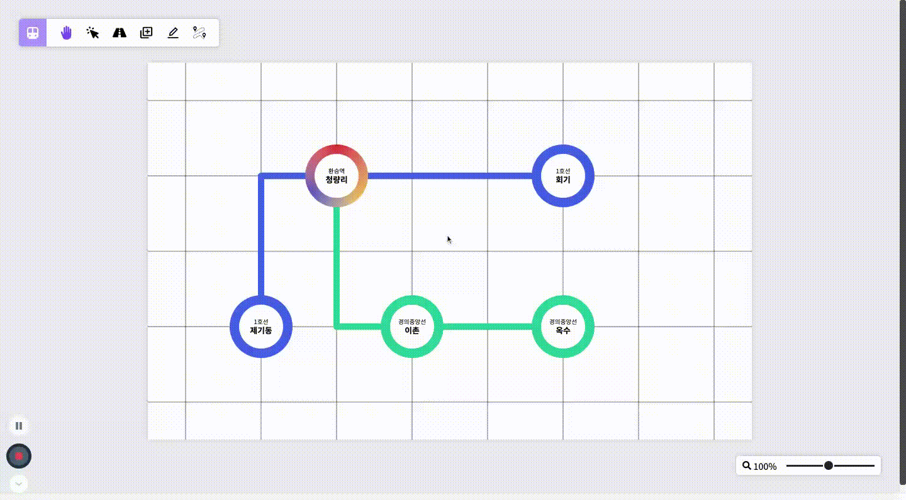

# Train Map Visualizer




Welcome, Let me introduce Train Map Visualizer Project! Train Map Visualizer is project that users can draw train route map as their want. I was inspired by the Subway Mission in Woowahan Tech Course, proceeded by Woowa Brothers Corporation. You can experience this project through the link below!

[https://train-map-visualizer.surge.sh](https://train-map-visualizer.surge.sh)

<br>

## Description

- After setting empty route map, you can **append Train Platform Element**.

  - For appending it, you should select Train Line Item and set name.

  - If there is no Train Line Item, it should be added, but this part is explained in the Management of Train Line Item section below.

- If there are two Train Platform Elements at least in train route map, you can **connect them with Train Line Element**.

  - Time required between stations is basically setted by the length of Train Line Element.

  - Each Train Line Elements cannot overlap, but can cross.

- You can **create, modify, or remove the Train Line Item**.

  - In there, you can change color and name of the Train Line Item.

- You can **check or modify information Train Platform Element or Train Line Element selected**.

  - In case of the Train Platform Element, you can append or remove Train Line Item and modify platform name.

  - In case of the Train Line Element, you can change time required between stations.

  - If you want, you can remove two elements.

- You can **find shortest path between stations**.

  - Likewise pathfinding function in other map service, if you set two platforms wanted to check shortest path, result is showed.

<br>

## Installation

1. Clone this repository

   ```
   git clone https://github.com/ji5485/Train-Map-Visualizer.git
   ```

2. Install dependencies (This project uses Yarn Berry)

   ```
   yarn
   ```

3. Run this project

   ```
   yarn start
   ```
